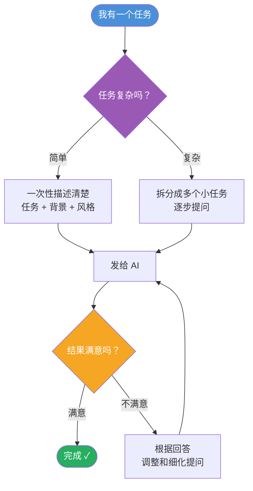
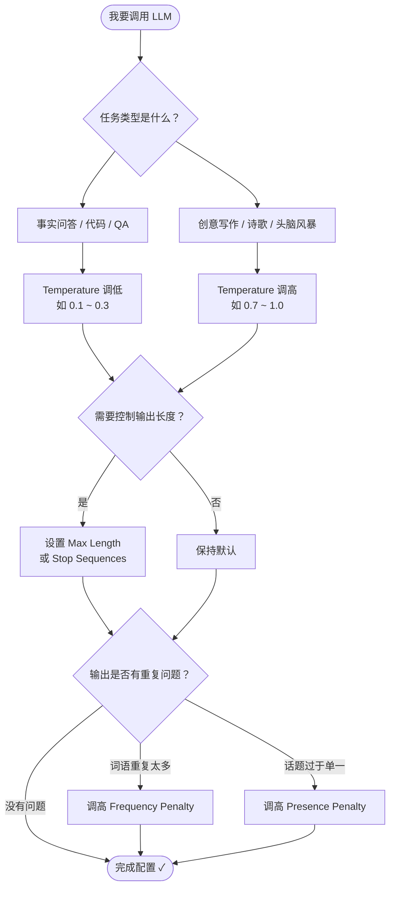

### 怎样才能创建好提示词

#### **跟 AI 说话，就像跟一个真人说话——你给的信息越清晰，它帮你做的事越准确。**

---

#### **核心思想**

AI 模型是靠大量人类对话文本训练出来的，所以它最擅长处理"像人类说话一样"的请求。你给它的指令越清楚、越详细，它的回答就越好。

---

#### **3 条核心技巧详解**

**1. 写清楚、说具体**
不要只说"帮我写个东西"，要告诉它：

- 任务是什么（写邮件？做总结？）
- 背景是什么（给谁看？什么场景？）
- 风格和语气（正式？轻松？简短？）

> 举例：不说"帮我写邮件"，而说"帮我写一封正式的商务邮件，向客户道歉并说明延迟发货的原因"。

**2. 拆分复杂任务，分步来问**
如果任务很复杂，不要一次性全塞给 AI。把它拆成几个小问题，一步一步来，每一步的结果都会更精准。

> 举例：不要一次说"帮我做市场分析报告"，而是先问"总结一下当前市场趋势"，再问"基于这些趋势，给出 3 个营销建议"。

**3. 把对话当成迭代过程**
第一次回答不满意？没关系，继续追问、调整、细化。不需要每次都写"完美的提示词"，把目标说清楚，跟 AI 来回对话就能越来越接近你想要的结果。

---

#### **流程图：如何创建一个好的 Prompt**

---

#### **一句话总结**

**说清楚任务、给足背景、复杂的拆开问、不满意就继续聊。**

把 AI 当成一个聪明但需要明确指引的助手，你越耐心解释，它帮你做的越好。

### **大语言模型的核心参数，就是在"确定性"和"创造性"之间做权衡。**

---

## **六个参数，逐一拆解**

#### **1. Temperature（温度）— 控制"大胆程度"**

想象模型在回答问题时，面前摆着一堆候选词。Temperature 决定它是"按部就班选最稳的"，还是"随机挑一个试试"。

- **低温度（如 0.1）**：回答保守、确定、重复性高 → 适合问答、事实核查
- **高温度（如 0.9）**：回答天马行空、富有创意 → 适合写诗、头脑风暴

#### **2. Top_p（核采样）— 控制"候选词范围"**

模型不是从所有词里随机选，而是先圈出"概率之和达到 top_p" 的一批词，再从这批词里选。

- **低 Top_p（如 0.1）**：只考虑最有把握的少数几个词 → 输出更精准
- **高 Top_p（如 0.9）**：考虑更多可能的词，包括冷门词 → 输出更多样

> **重要提示：Temperature 和 Top_p 只调其中一个就好，同时调会互相干扰。**

#### **3. Max Length（最大长度）— 控制"话说多长"**

直接限制模型最多输出多少个 token（可以理解为字/词）。防止模型啰嗦，也能控制 API 费用。

#### **4. Stop Sequences（停止词）— 控制"在哪里打住"**

设定一个"暗号"，模型一旦生成这个字符串就立刻停下来。比如设置 `"11"` 作为停止词，模型就不会生成超过 10 条的列表。

#### **5. Frequency Penalty（频率惩罚）— 惩罚"高频重复词"**

某个词出现得越多，下次再出现的概率就越低。出现 10 次的词比出现 2 次的词受到更重的惩罚。目的是让回答不要翻来覆去说同一个词。

#### **6. Presence Penalty（存在惩罚）— 惩罚"出现过的词"**

只要某个词出现过，不管出现几次，下次再出现都会受到相同力度的惩罚。鼓励模型引入新话题、新词汇，让输出更多元。

> **同样地：Frequency Penalty 和 Presence Penalty 也只调其中一个。**

---

## **流程图：参数决策思路**

---

## **一句话记忆口诀**

| 参数              | 一句话记忆                 |
| ----------------- | -------------------------- |
| Temperature       | 越高越"飘"，越低越"稳"     |
| Top_p             | 越高候选词越多，越低越保守 |
| Max Length        | 超过这个字数就闭嘴         |
| Stop Sequences    | 说到这个词就停             |
| Frequency Penalty | 说过的词，说得越多越不让说 |
| Presence Penalty  | 说过的词，一律少说         |

掌握这六个参数，基本上就能驾驭绝大多数 LLM 的调用场景了。
