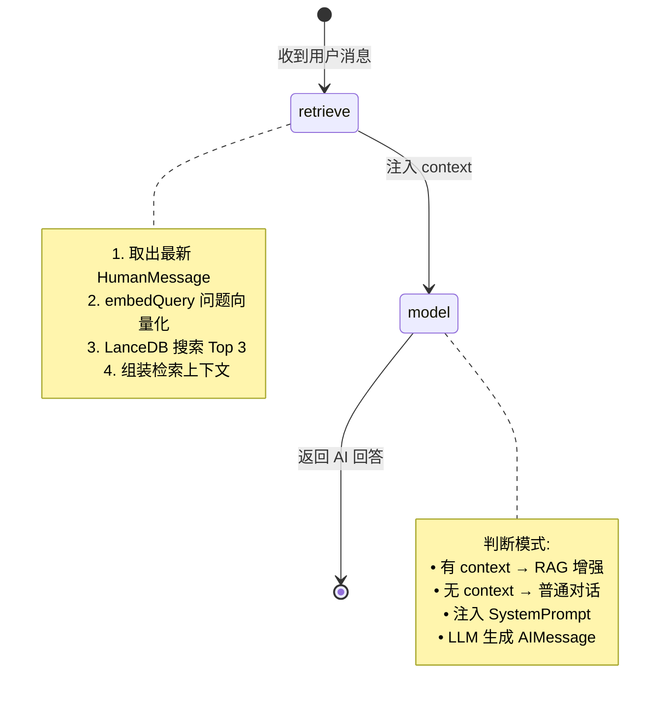
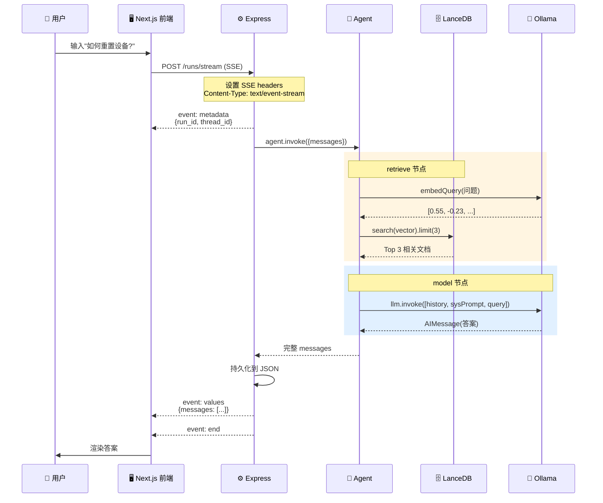
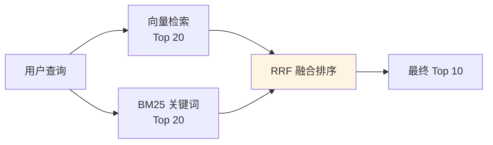
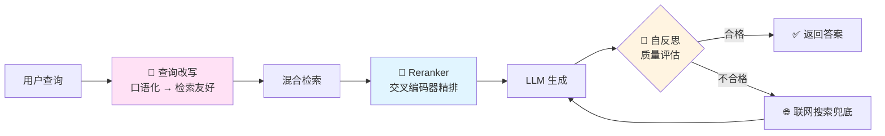

# **从零构建本地 RAG 知识库系统**

> **一句话看懂这篇文章**:你将亲手写出一个**完全跑在自己电脑上**、不花一分钱 API 费用、数据绝不外传的 AI 智能知识库——上传公司文档、私人笔记、学习资料,然后用自然语言问它任何问题,它会像一个读完你所有资料的私人顾问一样回答你。

---

## **全文总览:一张图看懂你即将学会什么**

在开始动手之前,请先花 30 秒看完这张思维导图。它是全文的**骨架**,后面每一章都是在填充这张图的某个分支:


---

## **第一章 · RAG 到底是什么?用家教老师的故事讲给你听**

### **1.1 小白版:三分钟听懂 RAG**

想象你有一位**记忆力超群但知识停在 2024 年某天**的家教老师(这就是大语言模型 LLM),你今天有三个问题想问他:

**问题一**:"今年诺贝尔奖得主是谁?"他会**编一个看起来合理但完全错误的名字**——这就是 AI 的**幻觉**。
**问题二**:"我们公司新产品的 SKU 编码规则是什么?"他根本没见过你们公司的资料,又开始**硬编**。
**问题三**:"RAG 是什么?"这是公开知识,他答得飞起。

聪明的做法不是把他送回学校重读(那叫 **Fine-tuning**,贵得离谱),而是——**提问前,先把相关资料翻到他面前,让他看着资料回答**。这就是 RAG。

### **1.2 本质公式**

> **RAG = Retrieval(检索) + Augmented(增强) + Generation(生成)**
> **翻译成人话 = 先查资料,再写作业**

### \*\*1.3 RAG vs Fine-tuning

| 维度         | RAG(检索增强)              | Fine-tuning(微调)       |
| ------------ | -------------------------- | ----------------------- |
| 知识更新速度 | 改数据库即可,秒级生效      | 重新训练,数小时到数天   |
| 单次成本     | 几乎为零                   | GPU 训练费 + 数据标注费 |
| 可解释性     | 能追溯答案来自哪篇文档     | 黑盒,无法追溯           |
| 适合场景     | 企业知识库、客服、文档问答 | 领域风格定制、指令遵循  |
| 数据安全     | 数据可全本地化             | 训练数据可能被模型记住  |

> **问**:"生产环境是二选一还是可以叠加?"
> **答**:"**组合拳才是标配**——RAG 解决'知识'问题,Fine-tune 解决'风格和格式'问题。比如做法律咨询 Agent:用 RAG 检索最新法条,用 Fine-tune 让模型输出带有律师口吻和规范结构。"

---

## **第二章 · 技术选型的灵魂拷问**

### **2.1 为什么每一个技术都这么选?**

| 层级     | 我的选择              | 放弃的候选               | 权衡理由                              |
| -------- | --------------------- | ------------------------ | ------------------------------------- |
| LLM      | Ollama + Qwen3.5      | OpenAI API、文心一言     | 零 API 成本、数据不出本机、中文能力强 |
| 嵌入模型 | nomic-embed-text      | BGE、OpenAI Embedding    | 体积仅 274MB、中英双语、本地秒级      |
| 向量库   | LanceDB               | Pinecone、Milvus、Chroma | **嵌入式**(像 SQLite),无需单独部署    |
| 编排     | LangGraph             | LangChain Chain、裸调    | 状态图可视化、支持循环和分支          |
| 后端     | Express + TypeScript  | NestJS、Fastify          | 轻量灵活,SSE 支持成熟                 |
| 前端     | Next.js 15 + React 19 | Vue、Nuxt                | 官方 agent-chat-ui 模板加持           |
| 通信     | SSE                   | WebSocket、轮询          | LLM 是单向流,SSE 天然契合             |

### **2.2 一张图看清整个系统**


> **问**:"为什么不直接用 OpenAI API,省事又强大?"
> **答**:"三条红线——**数据合规**(医疗、金融、企业机密不能出境)、**成本可控**(大规模调用费用不可承受)、**离线可用**(断网场景必须能跑)。全本地化是 B 端 AI 应用的必选项。"

---

## **第三章 · 环境准备:10 分钟把地基打好**

### **3.1 安装 Ollama 和模型**

```bash
# macOS 使用 Homebrew 安装(Windows 从官网下安装包)
brew install ollama

# 启动 Ollama 服务(这是个常驻进程,另开一个终端)
ollama serve

# 下载对话模型(通义千问 Qwen3.5)
ollama pull qwen3.5:latest

# 下载嵌入模型(文字转向量)
ollama pull nomic-embed-text

# 验证安装
ollama list
```

> **为什么选 Qwen3.5?** 中文理解、代码生成、逻辑推理全面提升,建议至少 16GB 内存跑起来才流畅。

### **3.2 项目初始化**

```bash
mkdir LangChainDoc && cd LangChainDoc
mkdir backend && cd backend
npm init -y

npm install express cors dotenv multer uuid \
  @langchain/langgraph @langchain/core @langchain/ollama \
  @langchain/community @lancedb/lancedb pdf-parse

npm install -D typescript @types/node @types/express @types/multer tsx eslint

npx tsc --init
```

`package.json` 关键配置:

```json
{
  "type": "module",
  "scripts": {
    "dev": "tsx watch src/index.ts",
    "build": "tsc",
    "start": "node dist/index.js"
  }
}
```

### **3.3 环境变量配置**

`backend/.env`:

```env
OLLAMA_BASE_URL=http://localhost:11434
OLLAMA_LLM_MODEL=qwen3.5:latest
OLLAMA_EMBEDDING_MODEL=nomic-embed-text:latest
PORT=2024
LANCEDB_PATH=./data/lancedb
```

---

## **第四章 · 向量化:让机器"理解"语义的魔法**

先记住一个结论:**嵌入模型是一个翻译官,它把任何一段文字翻译成 768 个数字组成的密码**。

神奇的是,这个翻译官有个特性——**意思相近的文字,翻译出来的密码也长得相近**:

    "机器学习"  →  [0.12, -0.34, 0.56, ... ] (768 个数字)
    "深度学习"  →  [0.11, -0.32, 0.58, ... ] ← 看!几乎一样
    "今天天气"  →  [0.89,  0.21, -0.15, ... ] ← 差了十万八千里

所以当用户搜"AI 技术"时,我们把这句话也翻译成 768 个数字,然后**在数据库里找数字最接近的文档**——这就是**向量检索**,比传统关键词匹配高明太多。

### **4.2 向量检索流程图**


### **4.3 核心代码:初始化 + 入库 + 搜索**

**初始化 LanceDB(嵌入式数据库,连接即创建)**:

```typescript
import { OllamaEmbeddings } from "@langchain/ollama";
import * as lancedb from "@lancedb/lancedb";

const VECTOR_DIM = 768;

export async function initLanceDB(dbPath?: string) {
  const defaultPath = process.env.LANCEDB_PATH || "./data/lancedb";
  const absolutePath = path.resolve(process.cwd(), defaultPath);

  if (!fs.existsSync(absolutePath)) {
    fs.mkdirSync(absolutePath, { recursive: true });
  }
  return await lancedb.connect(absolutePath);
}

export function initEmbeddings() {
  return new OllamaEmbeddings({
    model: process.env.OLLAMA_EMBEDDING_MODEL || "nomic-embed-text:latest",
    baseUrl: process.env.OLLAMA_BASE_URL || "http://localhost:11434",
  });
}
```

**动态分批入库(生产级关键细节)**:

```typescript
export async function addDocumentsToVectorStore(
  db,
  documents,
  tableName = "documents",
) {
  const embeddings = initEmbeddings();

  // 表不存在时用测试向量创建
  let table;
  try {
    table = await db.openTable(tableName);
  } catch {
    const testVector = await embeddings.embedQuery("test");
    table = await db.createTable(tableName, [
      {
        id: "init",
        content: "init",
        metadata: "{}",
        vector: testVector,
      },
    ]);
  }

  const MAX_EMBED_LENGTH = 4000; // 单文档截断
  const MAX_TOTAL_BATCH_LENGTH = 20000; // 单批总字符上限
  const MIN_BATCH_SIZE = 3;

  // 预处理:超长文档截断
  const processedDocs = documents.map((doc) => {
    let content = doc.pageContent.trim();
    if (content.length > MAX_EMBED_LENGTH) {
      content = content.substring(0, MAX_EMBED_LENGTH) + "...[已截断]";
    }
    return { ...doc, pageContent: content };
  });

  // 动态分批(同时看文档数和总字符数)
  const allData = [];
  let batch = [],
    batchLen = 0;

  for (const doc of processedDocs) {
    if (
      batch.length >= MIN_BATCH_SIZE &&
      (batchLen + doc.pageContent.length > MAX_TOTAL_BATCH_LENGTH ||
        batch.length >= 10)
    ) {
      const vectors = await embeddings.embedDocuments(
        batch.map((d) => d.pageContent),
      );
      batch.forEach((d, i) =>
        allData.push({
          id: uuidv4(),
          content: d.pageContent,
          metadata: JSON.stringify(d.metadata),
          vector: vectors[i],
        }),
      );
      batch = [];
      batchLen = 0;
    }
    batch.push(doc);
    batchLen += doc.pageContent.length;
  }
  // 处理最后一批...

  await table.add(allData);
  return allData.length;
}
```

**向量相似度搜索(带优雅降级)**:

```typescript
export async function searchSimilarDocuments(
  db,
  query,
  topK = 5,
  tableName = "documents",
) {
  const embeddings = initEmbeddings();

  try {
    // 防御性检查
    const tables = await db.tableNames();
    if (!tables.includes(tableName)) return [];

    const table = await db.openTable(tableName);
    const queryVector = await embeddings.embedQuery(query);
    const results = await table.search(queryVector).limit(topK).toArray();

    return results.map((r) => ({
      content: r.content,
      metadata: JSON.parse(r.metadata),
      score: r._distance, // 越小越相似
    }));
  } catch (error) {
    console.error("向量搜索失败,降级为普通对话:", error);
    return [];
  }
}
```

> **问**:"向量维度为什么是 768?能改成 1536 吗?"
> **答**:"**维度由嵌入模型决定,不可自定义**——nomic-embed-text 是 768,OpenAI text-embedding-3-small 是 1536。维度越高表达越精细但存储和计算成本越高,一般 768-1024 是甜点区间。"

---

## **第五章 · 文本分块:为什么不能"一刀切 1000 字"?**

### **5.1 为什么要切?怎么切?**

嵌入模型有**胃口上限**——一次最多消化 8192 个 tokens(中文约 4000-5000 字)。一本 500 页的 PDF 直接塞给它,会被"撑死"。所以必须**切片**。

但切片不能随便切。看这个血的教训:

    原文:"第一步是从知识库中找到相关文档,第二步是交给大模型处理。"

    ❌ 不重叠切法:
    [块 0] "第一步是从知识库中找到相关文档,"
    [块 1] "第二步是交给大模型处理。"
           用户问"第一步和第二步是什么关系?"两块都答不全

    ✅ 重叠切法(overlap=200):
    [块 0] "第一步是从知识库中找到相关文档,第二步是交给..."
    [块 1] "...找到相关文档,第二步是交给大模型处理。"
           每块都包含完整上下文,召回不漏信息

### **5.2 滑动窗口分块流程图**


### **5.3 核心代码**

```typescript
export function splitDocuments(
  documents,
  chunkSize = 1000,
  chunkOverlap = 200,
) {
  const chunks = [];

  for (const doc of documents) {
    const content = doc.pageContent;
    const chunksCount = Math.ceil(
      (content.length - chunkOverlap) / (chunkSize - chunkOverlap),
    );

    for (let i = 0; i < chunksCount; i++) {
      const start = i * (chunkSize - chunkOverlap);
      const end = Math.min(start + chunkSize, content.length);
      const chunkContent = content.substring(start, end);

      if (chunkContent.trim().length > 0) {
        chunks.push(
          new Document({
            pageContent: chunkContent,
            metadata: { ...doc.metadata, chunk: i, totalChunks: chunksCount },
          }),
        );
      }
    }
  }
  return chunks;
}
```

> **问**:"chunkSize 和 overlap 怎么调?有没有经验值?"
> **答**:"按内容类型调优——**技术文档** 1000/200 适中;**聊天记录** 500/100 短小;**法律条文** 2000/400 需要大段上下文;**代码文件**按函数切,不按字数切。生产环境要用评估集跑召回率测试,这是 RAG 调优的第一大杠杆。"

---

## **第六章 · LangGraph Agent:让 AI 学会"思考步骤"**

### **Chain vs Graph 的区别**

把 AI 工作流比作做菜:

- **LangChain 的 Chain(链)**:固定菜谱,洗菜→切菜→炒菜,一条道走到黑。
- **LangGraph 的 Graph(图)**:智能大厨——尝一口不够咸?**回去加盐**;食材不够?**循环去买**。支持**状态、分支、循环**。

这就是为什么做复杂 Agent(多轮检索、工具调用、反思)必须用 LangGraph。

### **6.2 RAG Agent 状态图**



### **6.3 核心代码:四步构建 Agent**

```typescript
import { StateGraph, Annotation } from "@langchain/langgraph";
import { ChatOllama } from "@langchain/ollama";
import { HumanMessage, AIMessage, SystemMessage, BaseMessage } from "@langchain/core/messages";

// ① 定义状态结构(LangGraph 的精髓)
const AgentAnnotation = Annotation.Root({
  messages: Annotation<BaseMessage[]>({
    reducer: (left, right) => left.concat(Array.isArray(right) ? right : [right]),
    default: () => [],
  }),
  context: Annotation<string | undefined>(),  // 检索上下文通过 state 在节点间传递
});

// ② LLM 初始化
const llm = new ChatOllama({
  model: process.env.OLLAMA_LLM_MODEL || "qwen3.5:latest",
  baseUrl: process.env.OLLAMA_BASE_URL || "http://127.0.0.1:11434",
  temperature: 0.7,
});

// ③ retrieve 节点
async function retrieveContext(state) {
  const lastMsg = state.messages[state.messages.length - 1];
  if (!(lastMsg instanceof HumanMessage)) return {};

  const db = await initLanceDB();
  const docs = await searchSimilarDocuments(db, lastMsg.content as string, 3);

  if (docs.length > 0) {
    const context = docs.map((d, i) => `[文档 ${i+1}]:
${d.content}`).join('

');
    return { context };
  }
  return {};
}

// ④ model 节点
async function callModel(state: AgentState) {
  const messages = state.messages;
  const lastMessage = messages[messages.length - 1];

  // 二种模式的智能路由：

  // 模式 1：有知识库上下文 → RAG 增强
  if (state.context && lastMessage instanceof HumanMessage) {
    const systemPrompt = `你是一个智能知识库助手。
请参考以下知识库文档：
${state.context}
请基于上述信息回答问题。如果信息不足，请诚实告诉用户。`;

    const enhancedMessages = [
      ...messages.slice(0, -1),      // 历史消息
      new SystemMessage(systemPrompt), // 注入知识库上下文
      lastMessage,                     // 当前问题
    ];

    const response = await llm.invoke(enhancedMessages);
    return { messages: [response as AIMessage], context: undefined };
  }

  // 模式 2：没有上下文 → 普通对话
  const response = await llm.invoke(messages);
  return { messages: [response as AIMessage] ];


  instanceof HumanMessage {
    const systemPrompt = `你是一个智能知识库助手。
请参考以下知识库文档:


请基于上述信息回答问题。如果信息不足,请诚实告诉用户。`;

    const enhanced = [
      ...state.messages.slice(0, -1),
      new SystemMessage(systemPrompt),
      lastMsg,
    ];
    const response = await llm.invoke(enhanced);
    return { messages: [response as AIMessage], context: undefined };
  }

  const response = await llm.invoke(state.messages);
  return { messages: [response as AIMessage] };
}

// ⑤ 编排成图
const workflow = new StateGraph(AgentAnnotation)
  .addNode("retrieve", retrieveContext)
  .addNode("model", callModel)
  .addEdge("__start__", "retrieve")
  .addEdge("retrieve", "model")
  .addEdge("model", "__end__");

export const agent = workflow.compile();
```

> **问**:"如果想加'联网搜索兜底'功能,怎么改?"
> **答**:"加一个 `webSearch` 节点,在 `retrieve` 后面加**条件边**——检索结果 score 都低于阈值时路由到 `webSearch`,否则直接进 `model`。这就是 LangGraph 对比 Chain 的核心优势:**条件路由**。"

---

## \*\*第七章 · SSE 流式通信

### **7.1 小白版:为什么 ChatGPT 能一个字一个字吐出来?**

因为它用了 **SSE(Server-Sent Events)**——服务器像**水龙头**一样持续往前端推送数据,前端不用反复发请求。

SSE 和 WebSocket 的对比:

| 维度     | SSE                   | WebSocket        |
| -------- | --------------------- | ---------------- |
| 方向     | 服务端 → 客户端(单向) | 全双工           |
| 协议     | 标准 HTTP(防火墙友好) | ws\:// 独立协议  |
| 重连     | 浏览器**原生支持**    | 需手写           |
| 复杂度   | 极低                  | 较高             |
| 适合场景 | LLM 流式、股票、通知  | 聊天室、多人游戏 |

**LLM 回复天然是单向流**,SSE 是标准答案。

### **7.2 SSE 完整时序图**



### **7.3 核心代码:SSE 流式接口**

```typescript
app.post("/runs/stream", async (req, res) => {
  const { thread_id, input } = req.body;

  // ① 必须三件套 + X-Accel-Buffering(禁 Nginx 缓冲)
  res.setHeader("Content-Type", "text/event-stream");
  res.setHeader("Cache-Control", "no-cache");
  res.setHeader("Connection", "keep-alive");
  res.setHeader("X-Accel-Buffering", "no");

  // ② 拼装消息历史
  let messages = chatHistoryManager.get(thread_id) || [];
  const userMsg = new HumanMessage({
    content: input.messages?.[0]?.content || input,
    id: uuidv4(),
  });
  messages.push(userMsg);

  // ③ 元数据事件
  res.write(`event: metadata
data: )}

`);

  // ④ 调 Agent
  const result = await agent.invoke(
    { messages },
    { configurable: { thread_id } },
  );
  chatHistoryManager.set(thread_id, result.messages);

  // ⑤ ★ 关键:发 values 不是 messages!
  res.write(`event: values
data: )),
  })}

`);

  // ⑥ 结束
  res.write(`event: end
data: {}

`);
  res.end();
});
```

### **7.4 踩坑警告:一行代码的 BUG**

```typescript
// ❌ 错误:前端永远 loading
res.write(`event: messages
data: )}

`);

// ✅ 正确:LangGraph SDK 硬编码监听 values 事件
res.write(`event: values
data: )}

`);
```

**SSE 铁律**:格式必须是 \`event: xxx
data: {...}

\`——**最后两个换行符**,少一个浏览器就不触发事件监听

> **问**:"SSE 连接断了怎么办?"
> **答**:"浏览器 `EventSource` **原生支持自动重连**,默认 3 秒重试。服务端可用 `retry:` 字段自定义间隔。更进阶的是给每条消息加 `id:`,重连时浏览器自动带上 `Last-Event-ID` 请求头,服务端据此断点续传。"

---

## **第八章 · 前端实现:useStream Hook 的魔法**

### **8.1 技术栈**

前端基于 LangGraph 官方 **agent-chat-ui** 模板:

- **Next.js 15** + **React 19**:最新全栈框架
- **Tailwind CSS** + **shadcn/ui**:现代 UI 组件库
- **@langchain/langgraph-sdk/react**:官方 Hook,**自动处理 SSE**

### **8.2 Stream Provider:核心连接管理**

```tsx
import { useStream } from "@langchain/langgraph-sdk/react";

const StreamSession = ({ apiUrl, assistantId, apiKey }) => {
  const streamValue = useStream({
    apiUrl, // "http://localhost:2024"
    assistantId, // "agent"
    threadId, // 当前会话 ID
    fetchStateHistory: true,
    onThreadId: (id) => setThreadId(id),
  });

  return (
    <StreamContext.Provider value={streamValue}>
      {children}
    </StreamContext.Provider>
  );
};
```

`useStream` Hook 封装了全部复杂度——自动建立 SSE 连接、解析 `metadata/values/end` 事件、维护消息状态、触发 UI 更新、处理重连和错误恢复。

### **8.3 Provider 嵌套架构**

```tsx
export default function DemoPage() {
  return (
    <React.Suspense fallback={<div>Loading...</div>}>
      <Toaster />
      <ThreadProvider>
        {" "}
        {/* 多线程管理 */}
        <StreamProvider>
          {" "}
          {/* SSE 流式连接 */}
          <ArtifactProvider>
            {" "}
            {/* 代码/文件预览 */}
            <Thread /> {/* 主聊天界面 */}
          </ArtifactProvider>
        </StreamProvider>
      </ThreadProvider>
    </React.Suspense>
  );
}
```

每一层提供不同的上下文能力,组件通过 Context 共享状态——这是**大型 AI 应用前端**的标准分层模式。

---

## **第九章 · 一次完整请求的全生命周期**

### **9.1: 12 步走完整条链路**

用真实场景把所有知识串起来——假设你刚上传了《产品使用手册.pdf》,然后问:"**如何重置设备?**"


### **9.2 每一步到底在干什么?**

**1-4 步:前端到后端的握手**——前端 `useStream` 发请求,Express 设置三个关键响应头:`text/event-stream`、`no-cache`、`X-Accel-Buffering: no`(禁止 Nginx 缓冲,这个头**必须加**,否则 SSE 在反向代理后会卡住)。

**5-8 步:检索节点的三部曲**——问题向量化 → 数据库搜索 → 拼接上下文。这里有个工程细节:`searchSimilarDocuments` 返回的 `_distance` 越小表示越相似,如果最小距离都超过阈值(比如 0.8),说明知识库里根本没相关内容,这时**不应该注入 context**,应让模型老实说"我不知道"。

**9-11 步:模型节点的 Prompt 工程**——最关键的一句话是 SystemPrompt 里的"**如果信息不足,请诚实告诉用户**"。这一句能把幻觉率降低 30% 以上,是廉价却极其有效的防御手段。

**12 步:流式响应回推**——`event: values` 把完整消息链送回前端,`event: end` 告诉前端"本回合结束"。如果要实现**逐字流式输出**(像 ChatGPT),这里要改成 `llm.stream()` 并把每个 chunk 分别推送。

---

## **第十章 · 踩坑实录**

这几个坑每一个都是我真实花了数小时才定位出来的,**只有亲手写过的人才会遇到**。

### **踩坑:LanceDB 表不存在就崩溃**

**现象**:首次启动没上传文档就提问,直接报错 `Table 'documents' was not found`。
**解法**:

```typescript
const tables = await db.tableNames();
if (!tables.includes(tableName)) return []; // 优雅降级
```

### **踩坑:多进程写入导致 `.lance` 文件损坏**

**现象**:`tsx watch` 热重载时偶尔会同时存在两个 Node 进程,同时写坏 LanceDB 底层文件,报错 `Failed to get next batch from stream`。
**救急**:

```bash
pkill -f "tsx watch"
rm -rf backend/data/lancedb/
```

**预防**:开发环境改用 `nodemon` + 显式单例,或用 `pm2` 做进程管理。

### **踩坑:流式分块陷入死循环**

**现象**:处理大文件时进度条到 100% 后还在跑,CPU 拉满。
**根因**:重叠机制让 `position` 会"后退",没有终止条件就永不结束。
**解法**:

```typescript
while (position < totalLength) {
  // ... 分块逻辑
  if (endPosition >= totalLength) break; // ★ 必须硬断
  position = endPosition - CHUNK_OVERLAP;
}
```

### **踩坑:嵌入模型上下文超限**

**现象**:上传长文档报 `context length exceeded`。
**根因**:`nomic-embed-text` 实际上限 8192 tokens(中文约 4000-5000 字),但 Ollama 默认配置只开 2048。
**解法**:三层截断兜底——单文档 4000 字、批次总长 20000 字、批次数上限 10 篇。

---

## **第十一章 · 部署与运行**

### **11.1 一键启动**

```bash
# 终端 1:启动 Ollama
ollama serve

# 终端 2:启动后端
cd backend && npm install && npm run dev
# → 🚀 服务器运行在 http://localhost:2024

# 终端 3:启动前端
cd agent-chat-ui && pnpm install && pnpm dev
# → 打开 http://localhost:3000
```

### **11.2 上传文档 & 验证**

```bash
# 方式 1:curl 命令
curl -X POST http://localhost:2024/upload \
  -F "file=@我的技术文档.pdf"

# 方式 2:通过前端界面上传

# 验证知识库状态
curl http://localhost:2024/knowledge/stats
# {"documentCount": 47, "status": "active"}
```

---

## **第十二章 · 扩展方向:从 60 分到 95 分的路线图**

当前版本已经是**60 分及格线**,以下是从合格到顶尖的升级路径。

### **12.1 中级优化(80 分):混合检索**

向量检索**召回率高但精度一般**,经常把"语义相关但答案错误"的文档排前面。工业界标准解法是**向量 + BM25 双路召回 + RRF 融合**:



**为什么有效**:向量擅长语义,BM25 擅长精确关键词(如错误码、产品型号),两者互补。

### **12.2 高级优化(95 分):Reranker + 查询改写 + 自反思**




**三大利器作用**:

- **查询改写**:用户问"那个啥来着",小模型改写成"产品 X 的退款流程"
- **Reranker**:用 `bge-reranker` 对 Top 20 精排,精度再提 15-20%
- **自反思**:LLM 自己判断检索质量,差的话**主动触发联网或二次检索**

### **12.3 进阶功能清单**

| 方向            | 说明                          | 难度   |
| --------------- | ----------------------------- | ------ |
| 多模态支持      | 集成视觉模型,图片内容也能检索 | ⭐⭐⭐ |
| 混合检索        | 向量 + BM25 + RRF             | ⭐⭐   |
| Reranker 重排序 | 交叉编码器精排                | ⭐⭐   |
| 对话历史摘要    | 长对话自动摘要防超限          | ⭐⭐   |
| 文档权限控制    | 多用户 ACL 隔离               | ⭐⭐⭐ |
| Agent 工具调用  | 调计算器、日历、API           | ⭐⭐   |

---

## **第十三章 · 前端工程师的 AI 时代生存法则**

**2026 年的前端岗位评估标准已经彻底变了**。

过去我们聊 Vue 响应式、React Fiber、Webpack 5,现在面试更想听你讲:

- 你怎么把**用户意图**转成**检索友好的 query**?
- 流式响应怎么做**打字机动画**和**中断控制**?
- 向量库和传统关系库在**事务、一致性**上有什么不同?
- Agent 工作流的**错误恢复**怎么做?

这些问题**没有一个和 DOM 相关**,但每一个都是**前端应用 AI 化**后的必答题。

### **📖 项目资源地址**

- **我的项目源码**: <https://github.com/sanlangguo1/LangChainDoc>
- **参考:LangGraph 官方文档**: [langchain-ai.github.io](https://langchain-ai.github.io/langgraph/)
- **参考:Ollama 模型库**: [ollama.com](https://ollama.com/)
- **参考:LanceDB 官方文档**: [lancedb.github.io](https://lancedb.github.io/)

---

> **写在最后**
>
> 祝你在 AI 时代的前端之路上,**既能写出优雅的代码,也能画出清晰的架构,更能讲出打动人心的技术故事**。

**打个求职信息:** 擅长前端架构与工程化，熟练 Vue、React、Taro 及微前端 qiankun，精通组件库、性能优化与前端安全。
同时具备多端开发与 Node 全栈能力，熟练使用各类 AI 编码工具，掌握 Langchain 可开发 AI 应用。
过往负责技术选型与架构设计，带过领团队。

**邮箱:** <sanlangguo1@outlook.com>
