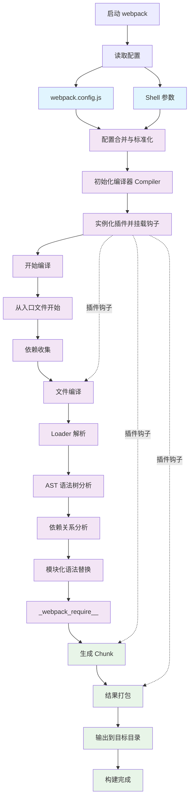
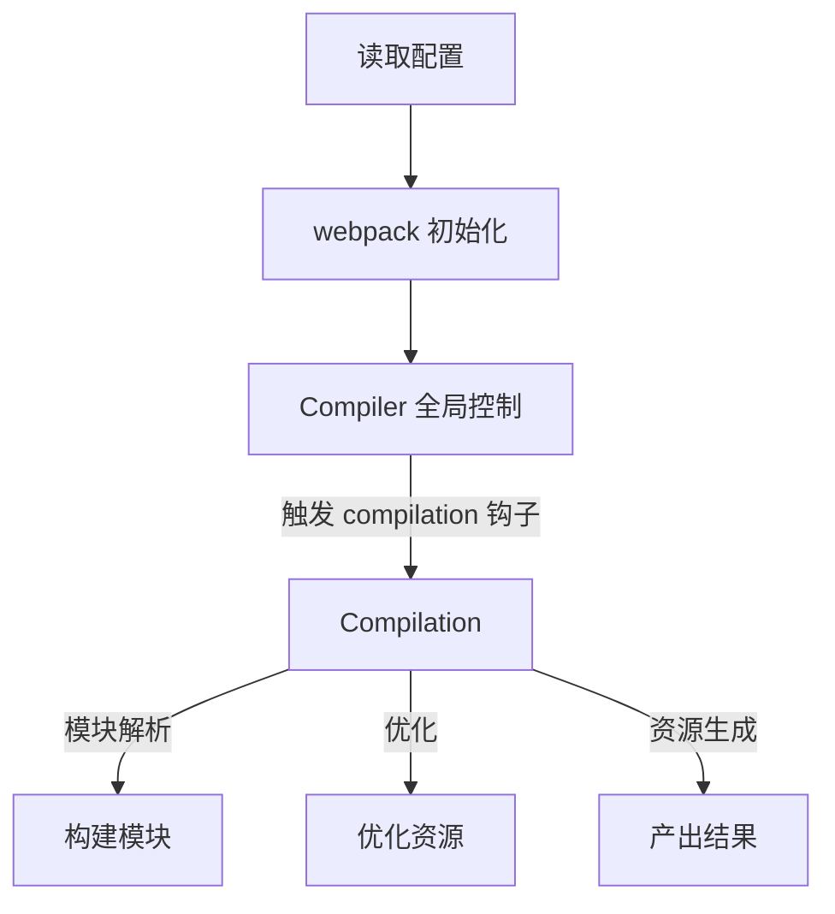

### webpack 工作原理

#### webpack 工作流程图：

#### 简单总结起来，流程大概如下。

- 首先，**webpack**会读取项目中由开发者定义的 **webpack.config.js**配置文件，或者从**shell**语句中获得必要的参数。这是**webpack**内部接收业务配置信息的方式。这样就完成了配置读取的譾氛步工作。
- 接着，将所需的**webpack**插件实例化，在**webpack**事件流上挂载插件钩子,这样在合适的构建过程中，插件就具备了改动产出结果的能力。
- 同时，根据配置所定义的人口文件，从入口文件(可以不止一个)开始，进行依赖收集，对所有依赖的文件进行编译,这个编译过程依赖**loaders**,不同类型的文件根据开发者定义的不同**loader** 进行解析。编译好的内容使用 **acorn** 或其他抽象语法树能力,解析生成抽象语法树,分析文件依赖关系，将不同模块化语法(如**require**)等替换为**_\_webpack_require_**，即使用**webpack**自己的加载器进行模块化实现。
- 上述步骤完戚后，产出结果，根据开发者配置，将结果打包到相应目录。

在整个打包过程中，**webpack** 是一个**基于事件驱动的编译器系统**，其核心架构围绕 **Tapable** 事件流系统构建, **webpack** 和插件都采用基于事件流的发布/订阅模式，某些关键过程，并在这些环节中执行插件任务。最后，所有文件的编译和转化都已经完成，输出劣终资源。
如果深人剖析源码，则上述过程可以用更加专业的术语总结为:模块会经历加载(**loaded**)、封存(**sealed**)、优化(**optimized**)、分块(**chunked**)、哈希(**hashed**)和重新创建(**restored**)这个经典步骤。

#### compiler 和 compilation

**compiler** 和 **compiation** 这两个对象是 **webpack** 核心原理中最重要的概念。它们是理解 **webpack**(作原理、**loader** 和插件工作的基础。
**compiler** 对象:它的实例包含了完整的 webpack 配置，且全局只有一个**compiler** 实例，因此它就像 **webpack**的骨架或神经中枢。当插件被实例化的时候，就会收到一个**compilier** 对象.通过这个对象可以访问**webpack** 的内部环境。

**compilation**对象:当**webpack**以开发式运行时，每当检测到文件变化时，一个新的**compilation**对象就会被创建。这个对象包含了当前的模块资源、编译生成资源、变化的文件等信息。也就是说，所有构建过程中产生的构建数据都会被存储在该对象上，它也掌控書建过程中的每一个环节。该对象还提供了很多事件回调供插件做扩展。

#### 流程图说明：

1. **Compiler** 是 webpack 的核心对象，负责全局控制和流程管理。
2. **Compilation** 是每次构建过程中生成的对象，负责代码解析、模块构建和资源生成。
3. **Compiler** 通过事件钩子（如 `compilation`）来触发 `Compilation` 的生成和执行。
4. **Compilation** 在构建过程中会经历多个阶段，如模块解析、优化和资源生成。

#### 简化版流程图：

#### 流程解释：

1. **读取配置**：`webpack` 首先读取配置文件，初始化构建环境。
2. **webpack 初始化**：`webpack` 完成初始化，准备开始构建过程。
3. **Compiler 全局控制**：`Compiler` 对象接管全局控制，负责触发构建过程中的各个事件钩子。
4. **Compilation**：`Compiler` 触发 `compilation` 钩子，生成 `Compilation` 对象。
5. **构建模块**：`Compilation` 开始解析模块，构建依赖图。
6. **优化资源**：`Compilation` 对构建的资源进行优化，如代码压缩、Tree Shaking 等。
7. **产出结果**：`Compilation` 生成最终的资源文件，输出到指定目录。

`webpack` 的构建过程是通过 `compiler` 控制流程，通过`compilation` 进行代码解析的。在开发播件时，我们可以从`compiler`对象中得到所有与 webpack 主环境相关的内容，包括事件钩子。更多信息将在下一节介绍。
瀠狛戢 se
`compiler` 对象和 `compilation`对象都继承自 tapable 库,该库暴露了所有和事件相关的发布/订阅的方法。`webpack`中基于事件流的`tapable`库不仅能保证插件的有序性，还能使整个系统扩展性更好
