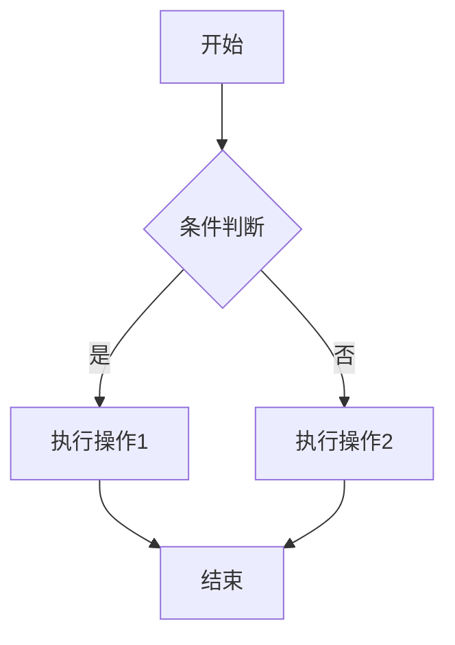
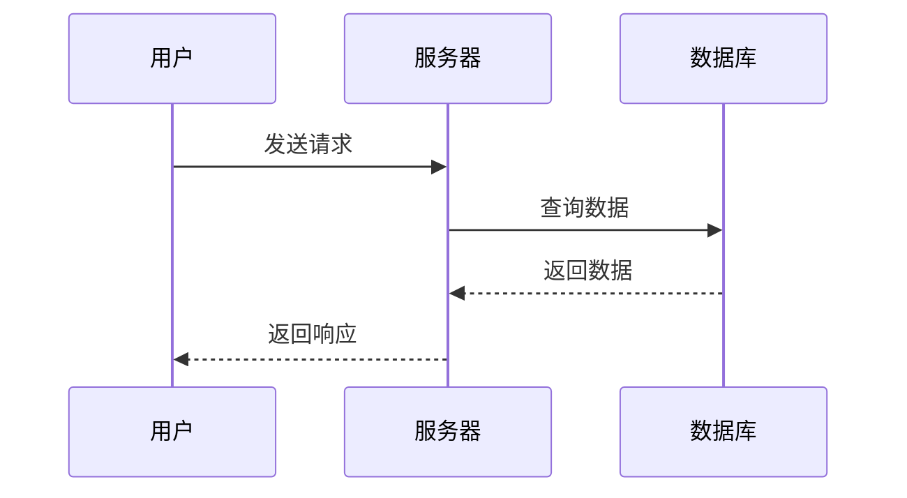
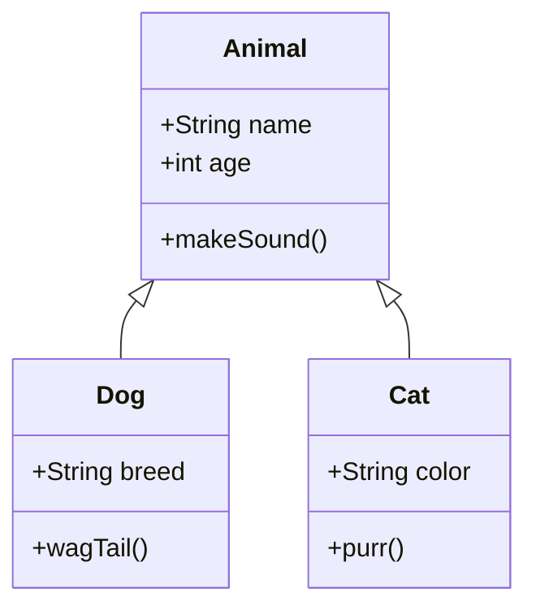
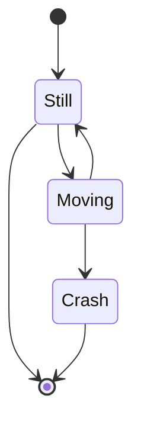
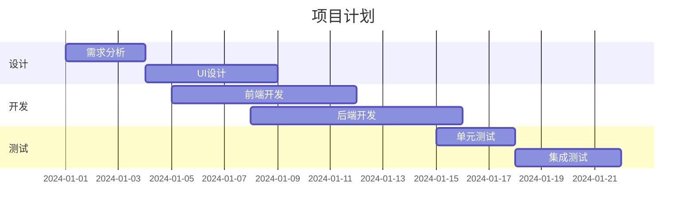

# Mermaid 图表示例

## 流程图 (Flowchart)

```mermaid
flowchart TD
    A[开始] --> B{条件判断}
    B -->|是| C[执行操作1]
    B -->|否| D[执行操作2]
    C --> E[结束]
    D --> E
```

## 序列图 (Sequence Diagram)

```mermaid
sequenceDiagram
    participant A as 用户
    participant B as 服务器
    participant C as 数据库
    
    A->>B: 发送请求
    B->>C: 查询数据
    C-->>B: 返回数据
    B-->>A: 返回响应
```

## 类图 (Class Diagram)

```mermaid
classDiagram
    class Animal {
        +String name
        +int age
        +makeSound()
    }
    
    class Dog {
        +String breed
        +wagTail()
    }
    
    class Cat {
        +String color
        +purr()
    }
    
    Animal <|-- Dog
    Animal <|-- Cat
```

## 状态图 (State Diagram)

```mermaid
stateDiagram-v2
    [*] --> Still
    Still --> [*]
    Still --> Moving
    Moving --> Still
    Moving --> Crash
    Crash --> [*]
```

## 甘特图 (Gantt Chart)

```mermaid
gantt
    title 项目计划
    dateFormat  YYYY-MM-DD
    section 设计
    需求分析           :a1, 2024-01-01, 3d
    UI设计            :after a1, 5d
    section 开发
    前端开发           :2024-01-05, 7d
    后端开发           :2024-01-08, 8d
    section 测试
    单元测试           :2024-01-15, 3d
    集成测试           :2024-01-18, 4d
```